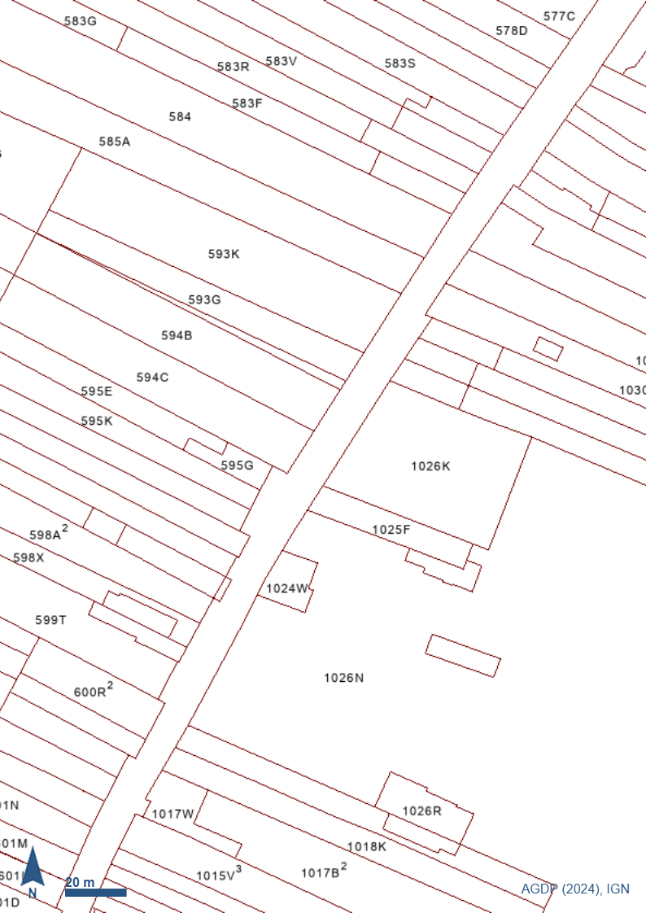
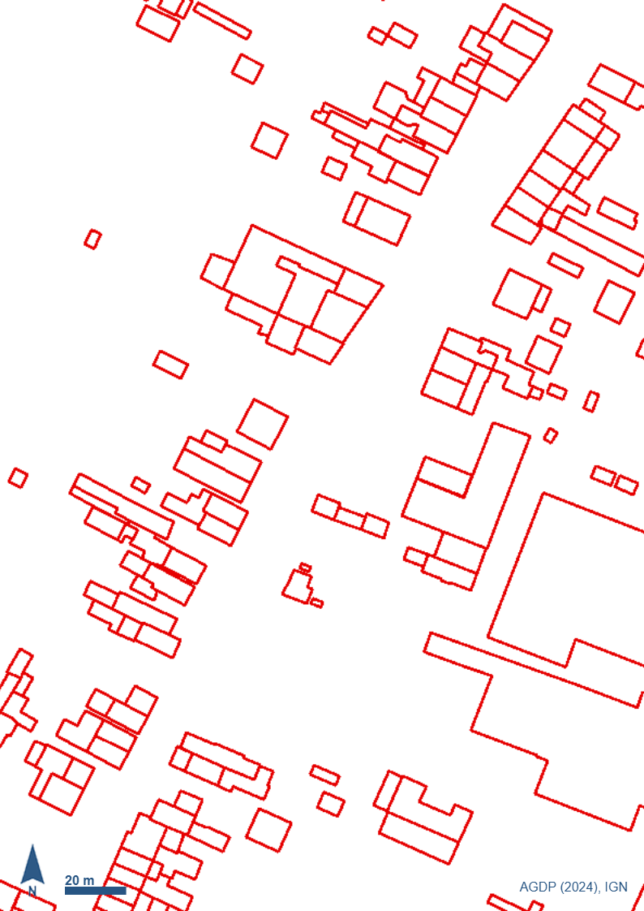
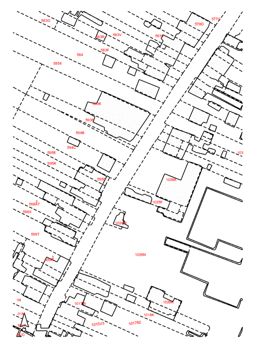

# pyKalfa

[Türkçe](README.md) · [English](README.en.md) · **Français**

Une extension pyRevit pour Revit. Elle extrait la géométrie des parcelles
et des bâtiments à partir d'images cadastrales, et de vrais murs à partir
de fichiers DXF de plans d'étage.

## Fonctionnalités

| Bouton | Rôle |
| --- | --- |
| **Parsel/Bina Aktar** | Convertit des images cadastrales (PNG) en géométrie Revit : limites de parcelles en `DetailLine`, bâtiments en `FilledRegion`, numéros de parcelles en `TextNote`. |
| **Duvar Aktar** | Convertit les murs d'un plan d'étage DXF en véritables éléments `Wall` de Revit. |

## Prérequis

- Windows + Autodesk Revit
- [pyRevit](https://github.com/pyrevitlabs/pyRevit)
- [Python 3](https://www.python.org) — cochez bien **« Add python.exe to PATH »** lors de l'installation

## Installation

1. Dans Revit, onglet **pyRevit** → **Extensions**.
2. Ajoutez une nouvelle extension avec cette adresse :
   ```
   https://github.com/cmldk/pyKalfa.git
   ```
3. Faites **Reload** (ou redémarrez Revit).

Les paquets Python nécessaires sont installés automatiquement au premier
démarrage. Cela prend quelques minutes (la bibliothèque OCR pèse environ
1 à 1,5 Go) et une barre de progression s'affiche. L'opération ne se
répète pas aux démarrages suivants.

> Facultatif : vous pouvez aussi télécharger le dossier via **Code →
> Download ZIP**, le renommer en `pyKalfa.extension` et ajouter son
> dossier **parent** dans pyRevit → Settings → *Custom Extension
> Folders*.

## Utilisation

### Parsel/Bina Aktar — parcelles et bâtiments

| Entrée : parcelles | Entrée : bâtiments | Sortie : Revit |
| :---: | :---: | :---: |
|  |  |  |

Vos propres images doivent ressembler à ces exemples du dossier
`assets/` : deux calques du même extrait cadastral, à la **même taille
en pixels**, avec l'échelle graphique visible.

1. Placez-vous dans une vue en **plan, de détail, en coupe ou en
   élévation** (cela ne fonctionne pas en vue 3D).
2. **pyKalfa** → **Parsel / Bina** → **Parsel/Bina Aktar**.
3. Renseignez les entrées au fur et à mesure :
   - sélectionnez l'image des parcelles (PNG)
   - sélectionnez l'image des bâtiments (PNG)
   - saisissez le dénominateur de l'échelle (`500` pour 1:500)
   - choisissez un **Line Style** pour les limites de parcelles
   - choisissez un **Filled Region Type** pour les bâtiments
   - choisissez un **Text Note Type** pour les numéros de parcelles
4. Le traitement d'image s'exécute derrière une barre de progression ;
   aucune question ne vous est posée pendant cette étape.
5. La géométrie est dessinée, puis un résumé des éléments créés
   s'affiche.

> Les numéros de parcelles sont lus par OCR, avec une précision
> d'environ 80 %. Des caractères proches (G/6, A/4, B/8, S/5) peuvent
> être confondus : comparez le résultat avec l'image source et corrigez
> manuellement si nécessaire.

### Duvar Aktar — murs à partir d'un DXF

1. Placez-vous dans une **vue en plan** correspondant au niveau des
   murs.
2. **pyKalfa** → **Duvar** → **Duvar Aktar**.
3. Ensuite :
   - sélectionnez le **fichier DXF**
   - *(si nécessaire)* confirmez l'unité du dessin, le recentrage vers
     l'origine ou le mode ligne simple
   - choisissez le **calque** — l'outil propose le calque de murs le
     plus probable. Les portes et fenêtres étant dessinées exactement
     comme les murs, seul le calque permet de les distinguer : cette
     étape est importante
   - indiquez la **hauteur de mur**, puis choisissez un **Level** et un
     **Wall Type**
4. Validez ; à la fin, le nombre de murs créés et échoués ainsi que la
   longueur totale s'affichent.

> L'import complet forme une seule transaction : si le résultat ne vous
> convient pas, un simple **Ctrl+Z** dans Revit annule tout.

## Licence

[MIT](LICENSE)
